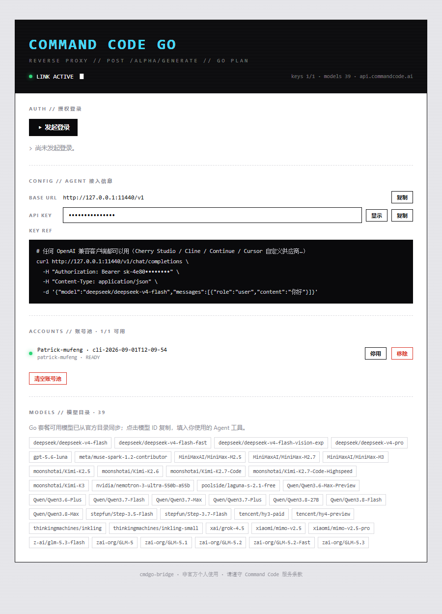

# cmdgo-bridge

把 **Command Code Go 套餐**接入任意 Agent 工具的本地桥接服务。

> 本仓库是 [Patrick-mufeng/cmdgo-bridge](https://github.com/Patrick-mufeng/cmdgo-bridge) 的 fork，上游提交历史完整保留。在原版基础上做了一轮完整审计与缺陷修复：协议合规与用量统计、并发与持久化竞态、管理面安全边界、上游连接泄漏，并补齐了一套零依赖回归测试（`npm test`）。

Command Code 的订阅分两种:标准 Provider API(OpenAI 兼容,任何工具可直连)和 **Go 套餐**($1/月)。Go 套餐调官方 OpenAI 端点返回 `403 upgrade_required`,只能走 CLI 私有网关 `POST /alpha/generate`。本项目把 Go 订阅包装成 **OpenAI 兼容 API**——Cherry Studio、Cline、Roo Code、Continue、Cursor、ZCode 等所有支持自定义 OpenAI 端点的工具都能直接用,自带 Web 控制台完成 OAuth 登录与多账号池管理。

## 功能特性

- **OpenAI 兼容 API**:`POST /v1/chat/completions`(流式 / 非流式)、`GET /v1/models`,支持工具调用、`reasoning_effort`、`max_tokens`、`temperature` / `top_p`
- **图片输入(多模态)**:`image_url` 支持内联 `data:` URL 与远程 `http(s)` 地址,落地为上游 `{ type:'image', source:{ type:'base64', … } }` 信封;模型确实能读像素(见下文「图片输入」)
- **OAuth 登录**:控制台一键生成登录地址,浏览器授权后 API key 自动回收入池,免手动复制
- **多账号池**:每完成一次登录新 key 自动成为独立账号,请求级 round-robin 摊薄额度;失败(401/403/429/5xx/网络错误)自动指数冷却并故障转移,绝不重放半截回答
- **并发上限与背压**:全局最多 16 个对话请求同时在跑,超出直接返回 `429` + `Retry-After`(而不是在上游排队);客户端停止读取时按写缓冲水位断开,不让上游额度白白消耗(见下文「并发与背压」)
- **模型目录同步**:自动从官方目录拉取 Go 套餐可用模型(含 reasoning effort 元数据),15 分钟刷新。目录刷新失败时**保留上一次成功的结果**;首次启动就失败则列表为空——此时 `/v1/chat/completions` **仍然可用任意 model id**(不校验白名单),详见下文「模型目录的降级语义」
- **自带 Web 控制台**:登录、凭据、账号池、模型列表一目了然,零配置上手
- **零依赖桥**:无需 DSH / 任何框架,Node ≥ 20 即可运行,数据落盘在用户目录

### 不支持的请求参数

上游私有网关没有对应能力、因此**明确返回 400 `unsupported_parameter`**(而不是静默忽略)的字段:

| 参数 | 原因 |
| --- | --- |
| `n` | 本桥固定只回 1 个 choice;`n: 1` 与缺省等价,照常接受 |
| `stop` | Command Code 网关没有停止序列参数 |
| `response_format` | 网关没有响应格式参数,`json_object` 无法生效 |
| `tool_choice` | 无法强制或禁止工具调用;`auto`(缺省语义)照常接受 |
| `parallel_tool_calls` | 同上;`true`(缺省语义)照常接受 |

静默忽略会让调用方以为参数生效了——`n: 3` 只拿到 1 个 choice、要 JSON 却拿到散文,都要等到自己的解析器失败才发现。错误响应里的 `error.param` 会指明是哪个字段。

以下字段会被忽略但**不报错**(只影响回答内容、不改变回答结构,或本桥行为已满足):
`stream_options`(本桥在干净结束的流上**总是**发 usage,已覆盖 `include_usage: true`)、`seed`、`logprobs` / `top_logprobs`、`presence_penalty`、`frequency_penalty`、`logit_bias`、`user`。

### `max_tokens` 与模型上下文窗口

`max_tokens`(或 `max_completion_tokens`)**超过该模型的上下文窗口**时返回 400:

```json
{"error":{"message":"\"max_tokens\" (200000) exceeds the context window of xiaomi/mimo-v2.6-flash (163840)","type":"invalid_request_error","code":"context_length_exceeded","param":"max_tokens"}}
```

窗口取自 `/v1/models` 的 `context_length`(上游清单里的真实值,缺失时用 `defaultContextWindow`)。**模型不在目录里**时按 `defaultContextWindow` 比较——目录只是过滤后的视图,`/v1/chat/completions` 接受目录外的 model id,用更小的值判断会把本来能用的请求拒掉。

这条校验是**行为变更**(2026-09 修复批次):此前 `max_tokens: 1e9` 会被原样透传给上游、由一个措辞不定的上游错误结束,本桥只能靠正则猜那是"上下文超限"。现在在下发前就拒掉,`error.param` 与 `code` 都明确,便于下游自动收缩重试。缺省 `max_tokens` 不受影响。

## 界面预览



## 快速开始

### 1. 前置条件

- **Node.js ≥ 20.3**(含 `npm`),验证:`node --version`

### 2. 获取项目

```sh
git clone https://github.com/zhourenke/cmdgo-bridge.git
cd cmdgo-bridge
```

或者直接下载仓库 ZIP 并解压。

### 3. 安装依赖并构建

```sh
npm install
npm run build
```

### 4. 启动

**Windows**:双击 `start.cmd`(保持窗口开启即在线,关闭即停止)。

**任意平台**(命令行):

```sh
npm start              # 或: node dist/index.js
```

首次启动自动生成配置,终端会打印类似:

```
OpenAI 端点: http://127.0.0.1:11435/v1
客户端 API key: 4e80cd8cbac4c07ab03db0afc95fdb5c1d0d9f9f22d073f7
```

### 5. 完成 OAuth 登录

1. 浏览器打开 **http://127.0.0.1:11435/**
2. 点「**▸ 发起登录**」→ 出现登录地址,点「**打开登录页 ↗**」
3. 在 Command Code 授权页确认,浏览器会把 API key 回传给本机
4. 控制台状态变为「**✓ 授权成功**」,账号出现在账号池(状态 `READY`)

### 6. 在 Agent 工具中配置

任意 OpenAI 兼容客户端,填三项:

| 配置项 | 值 |
| --- | --- |
| Base URL | `http://127.0.0.1:11435/v1` |
| API Key | 终端打印的 key(或控制台 CONFIG 区查看/复制) |
| 模型 ID | 控制台 MODELS 区列出的模型,点击即复制(如 `deepseek/deepseek-v4-pro`) |

验证连通:

```sh
curl http://127.0.0.1:11435/v1/chat/completions \
  -H "Authorization: Bearer <你的API Key>" \
  -H "Content-Type: application/json" \
  -d '{"model":"deepseek/deepseek-v4-pro","messages":[{"role":"user","content":"你好"}]}'
```

各家工具接入举例:

- **ZCode / Cherry Studio / NextChat / LobeChat**:新增 OpenAI 兼容供应商,填上表三项即可
- **Cline / Roo Code**:OpenAI Compatible 供应商,Base URL 填 `http://127.0.0.1:11435/v1`
- **Cursor**:Settings → Models → OpenAI API Key 填 bridge key,并覆写 Base URL 为 `http://127.0.0.1:11435/v1`
- **Continue**:config.json 里加 `{"provider":"openai","apiBase":"http://127.0.0.1:11435/v1",...}`

## 多账号池

每完成一次 OAuth 登录,新 key 自动成为池中一个独立账号(元数据落在数据目录 `accounts.json`,key 在 `credentials.json`);重复登录同一 key 只刷新标签。

- 请求级 **round-robin** 调度;某账号失败按指数冷却(30s 起、封顶 15min),当次请求内自动切换下一账号
- 控制台可**停用 / 启用 / 移除**单个账号,「清空账号池」清空全部

## 配置

数据目录默认 `~/.cmdgo-bridge/`(可用 `--data-dir` 指定),`config.json` 首次启动自动生成:

| 配置项 | 默认 | 说明 |
| --- | --- | --- |
| `host` | `127.0.0.1` | 监听地址。**改成非回环地址（如 `0.0.0.0`）会让无鉴权的管理面暴露给网络内任何客户端**：`/api/status` 会返回客户端 API key，`/api/logout` 会清空账号池。启动时会打印显著告警；非回环来源的 `/api/status` 不再下发 `apiKey`（见下） |
| `port` | `11435` | 监听端口 |
| `baseURL` | `https://api.commandcode.ai` | 网关 base,`/alpha/generate` 自动追加 |
| `apiKey` | 随机生成 | 客户端 Bearer token(改动手动写入需 ≥8 字符) |
| `maxTokens` | `64000` | 单次输出上限 |
| `defaultContextWindow` | `262144` | 上游清单未披露容量时的兜底;正常情况用清单里的真实值,经 `/v1/models` 的 `context_length` 下发给客户端 |
| `allowedHosts` | `[]` | 允许访问控制台 / 管理面的额外域名(经反向代理或局域网域名访问时填写);回环名、IP 字面量与 `host` 本身始终允许 |
| `images.maxBytes` | `8388608` | 单张图片解码后字节上限 |
| `images.maxPerRequest` | `12` | 单次请求图片数量上限(跨所有消息合计) |
| `images.fetchTimeoutMs` | `15000` | 远程图片 URL 抓取超时 |
| `images.maxRedirects` | `3` | 远程图片 URL 允许的重定向跳数 |
| `images.allowPrivateNetwork` | `false` | 是否允许远程图片 URL 指向回环 / 内网地址 |

命令行参数:`--host <addr>`、`--port <port>`、`--data-dir <dir>`、`--help`。注意:`--host` / `--port` 会**写回 `config.json` 持久化**,下次启动继续生效。

图片限制也可用环境变量临时覆盖(优先级高于 `config.json`):`CMDGO_IMAGE_MAX_MB`、`CMDGO_IMAGE_MAX_PER_REQUEST`、`CMDGO_IMAGE_FETCH_TIMEOUT_MS`、`CMDGO_IMAGE_ALLOW_PRIVATE_NETWORK`。

## API 端点

| 端点 | 鉴权 | 说明 |
| --- | --- | --- |
| `GET /v1/models` | Bearer | 模型列表(含 `context_length` 上下文容量;`created` 为目录同步时刻,`owned_by` 取自 id 前缀) |
| `POST /v1/chat/completions` | Bearer | 对话补全(流式 / 非流式) |
| `GET /health` | 无 | 健康检查(不含任何凭据;含 `chatInFlight` / `chatCapacity`) |
| `GET /` | 无 | 控制台页面 |
| `GET /api/status` | 无鉴权 | 登录 / 账号 / 模型状态快照;**仅回环来源**的响应包含 `apiKey` |
| `POST /api/login` `cancel` `logout` | 无鉴权 | 登录生命周期 |
| `POST /api/account/toggle` `remove` | 无鉴权 | 账号管理 |
| `POST /api/reload` | 无鉴权，**仅回环来源** | 重新读取 `accounts.json` 与 `credentials.json`（手改文件后免重启；解析失败返回 500 并说明是哪个文件） |
| `POST /api/rotate-key` | 无鉴权，**仅回环来源** | 轮换客户端 API key；返回新值，旧值**立即失效**，无需重启 |

> **管理面（`/api/*`、`/health`、控制台页面）不携带 token**。它额外校验 `Origin` 同源与 `Host` 白名单:其它站点发起的**浏览器跨源请求**、以及把域名解析到回环地址的 DNS rebinding 都会被 403 拒绝。
>
> ⚠️ 这两道校验**只对浏览器有效**。`curl`、脚本、以及任何非浏览器客户端都不发送 `Origin`，因此会被直接放行——这正是「无 `Origin` 的真实请求返回 200」这一既有行为。所以**管理面的实际边界取决于监听地址**：保持默认 `127.0.0.1` 时只有本机可达；一旦绑定 `0.0.0.0`，网络内任何客户端都能读取 `apiKey` 并清空账号池。
>
> 为此设置了两道纵深防御：绑定非回环地址时启动会打印显著告警；`/api/status` 对**非回环来源**的请求不下发 `apiKey` 字段（控制台此时显示「非回环来源，已隐去」）。`/v1/*` 保持宽松 CORS，由 Bearer token 保护。

### 停机与落盘

`accounts.json` 会在两类不经过请求的场景下被改写：控制台操作（启用/禁用/移除/清空）与失败冷却计数。为避免"改了又没了"，现在：

- `POST /api/account/toggle`、`remove`、`logout`、`rotate-key` 都是**写盘完成后才返回 `ok`**——看到 `ok` 就意味着重启后状态还在。
- `Ctrl-C`（SIGINT）与 `SIGTERM` 会依次：关掉监听 → 等在途请求结束（最多 10 秒，超时则强制断开）→ `pool.flush()` 排空待写入的清单 → 退出。日志依次打印「收到 SIGINT，正在退出…」「账号清单已落盘，退出完成」。
- 写入失败（数据目录只读、磁盘满）不再静默：会同时写日志与 stderr，本次会话仍以内存状态继续服务，但**重启会丢**。看到 `账号清单写入失败` 就去查目录权限。

### 轮换客户端 API key

客户端 API key（`config.json` 的 `apiKey`）与上游 Command Code 账号凭据是**两个独立的东西**：前者是室友/朋友的 Agent 工具连本桥用的，后者是桥连上游用的。重新 OAuth 登录不会改变前者。

怀疑前者泄露、或有人退出共享时，按下面任一种方式轮换：

**方式一：控制台（推荐）**

1. 在运行 cmdgo-bridge 的机器上打开 `http://127.0.0.1:11435/`（必须是本机——非回环来源看不到 key，也无法轮换）
2. CONFIG 区 → API KEY 一行 → 点「轮换」
3. 确认对话框会说明影响：旧 token 立即失效、新值写入 `config.json`、不影响上游授权
4. 轮换后页面会直接显示新 key，用「复制」分发下去

**方式二：命令行 runbook（控制台打不开时）**

```powershell
# 1) 生成新 token 并安全写回（node 写入 = 无 BOM；保留 config.json 其余所有字段）
node -e "const fs=require('fs'),crypto=require('crypto'),p=process.argv[1];const c=JSON.parse(fs.readFileSync(p,'utf8'));c.apiKey=crypto.randomBytes(24).toString('hex');fs.writeFileSync(p,JSON.stringify(c,null,2),'utf8');console.log('new token written')" "$env:USERPROFILE\.cmdgo-bridge\config.json"

# 2) 重启桥（token 在启动时读取，手工改文件不重启不生效）
#    关掉那个 start.cmd 窗口，再在仓库目录执行 npm start
# 3) 校验新 token 生效、旧 token 失效（把 <新token> 换成上一步打印的值）
curl.exe -s -o NUL -w "new=%{http_code}`n" -H "Authorization: Bearer <新token>" http://127.0.0.1:11435/v1/models
```

> 两种方式的区别：控制台轮换**不需要重启**（`authorized()` 每次请求都读当前配置），命令行方式**必须重启**。
>
> 手改文件用无 BOM 的 UTF-8 最稳妥，但**带 BOM 也不会再出问题**：三个状态文件（`config.json` / `credentials.json` / `accounts.json`）现在都会先剥掉 UTF-8 BOM 再解析。此前 BOM 会让 `config.json` 被判定为损坏并**静默重新随机生成**一个 key（所有下游 401，且日志不说明原因），也会让 `accounts.json` / `credentials.json` 读成"空"，进而被下一次写入覆盖掉——这也是控制台「轮换」按钮存在的原因。

## 并发与背压

3 人共享时最容易踩的不是额度，而是**并发**：一个 Agent 工作区同时开多个会话，就会在桥这一侧变成同数量的上游并发请求，其他人全排在它们后面，而且排队发生在供应商那边——桥看不到，也没法告诉你。

- **全局并发上限 16**（含流式与非流式，跨所有账号）。超出的请求**不会**排队，而是立刻拿到：

  ```http
  HTTP/1.1 429 Too Many Requests
  Retry-After: 2

  {"error":{"message":"并发对话请求已达上限（16），请稍后重试","type":"invalid_request_error","code":"rate_limit_exceeded","param":null}}
  ```

  这是**真的状态码**，不是 SSE 里的事件——流式路径一旦发出响应头，状态码就冻结在 200，任何"超载"都只能伪装成一次成功的回答，客户端无从分辨。所以容量检查发生在提交响应头**之前**。
  上限的余量按 3 人共享留得很宽（16 远高于实际需要），但足以防止单个失控客户端占满全部额度。想看当前占用：`GET /health` 的 `chatInFlight` / `chatCapacity`。

- **背压**：客户端停止读取（终端暂停、笔记本休眠、中间代理卡住）时，上游仍在生成 token、额度仍在扣。桥现在跟踪响应写缓冲，超过 1 MiB 就开始等 `'drain'`，若 **30 秒**仍无法排出就断开该连接并停止读取上游，日志记录 `client-stalled`。

> 调参：这两个上限目前是代码常量（`src/server.ts` 的 `MAX_CONCURRENT_CHATS` / `WRITE_BUFFER_HIGH_WATER` / `WRITE_DRAIN_TIMEOUT_MS`），没有做成 `config.json` 项——按 D-2 的三人非商业共享范围，固定值足够且少一个误配点。需要调整时改常量重新构建即可（`buildState()` 也接受 `limits` 覆盖，测试用的就是这条路径）。

## 图片输入
`messages[].content` 里的 `image_url` 部分会被转换成上游网关接受的信封:

```jsonc
{ "role": "user", "content": [
  { "type": "text", "text": "这张图里是什么?" },
  { "type": "image_url", "image_url": { "url": "data:image/png;base64,iVBORw0..." } }
] }
```

支持的写法与行为:

- 内联 `data:` URL(base64,`png` / `jpeg` / `gif` / `webp`);声明类型与实际字节不符时以**字节嗅探结果**为准
- 远程 `http(s)` URL:由 bridge 代抓,带 SSRF 防护(解析后为回环 / 内网 / 链路本地地址直接拒绝,默认禁 `http` 到内网),限制体积、超时与重定向跳数
- 别名 `input_image` 同样接受;`input_audio` / `input_file` / `video` 等明确返回 400(而不是静默丢弃,避免误以为已转写)
- 图片体积超限、格式非法、数量超过 `images.maxPerRequest` 时返回 400,报文说明具体原因

**base64 校验**:`data:` URL 的 payload 会**先按 base64 校验再解码**,两类失败分得很清:

- `data: URL payload is not valid base64 (…)` —— 编码本身有问题:字母表之外的字符、长度对 4 取余为 1(末尾挂着半个字节)、超过两个 `=`、`=` 出现在中间、未填充但末尾字符带有多余位。括号里会说明具体是哪一种。
- `data: URL: unrecognized image format (expected png/jpeg/gif/webp)` —— 编码合法,但解出来的字节不是支持的图片。

这两条以前是混在一起的:Node 的 `Buffer.from(x,'base64')` **从不抛错**,它只是静默丢弃字母表之外的字符,所以原来那句"拒绝非法 base64"的 `catch` 是**死代码**,任何畸形输入都会被解码成垃圾字节、再由魔数嗅探以"unrecognized image format"拒掉——把排查方向带偏到格式问题上。行为本身一直是安全的(非法字符只会让解出的字节**更少**,不可能放大),改的是可诊断性。

两点宽容性保持不变:payload 里的**空白符会被先剥掉**(MIME 换行是合法 base64);**未填充**(无 `=`)的规范编码照常接受。

**缓存复用**:上游的 prompt cache 是**前缀缓存**,因此实现上刻意保证——不含图片的消息仍序列化为原来的纯字符串 `content`,与加入图片功能之前的信封逐字节一致;同一张图片的 base64 编码是确定性的(不重新编码)。所以纯文本会话不会因为本功能丢掉任何缓存,而带图会话只要图片字节不变,重复请求也能命中前缀缓存。

**注意**:推理型模型的 `max_tokens` 会被思维链先消耗。带图请求若把 `max_tokens` 设得过小(例如 200),可能只输出空内容——此时 `usage.completion_tokens_details.reasoning_tokens` 已接近上限,把预算放宽即可,并非图片没被读到。

排查上游信封是否仍被接受(会真实消耗额度):

```sh
node scripts/probes/upstream-image-probe.mjs    # 逐个试探信封形态
node scripts/probes/upstream-image-probe2.mjs   # 用不可猜的图片验证「真的看得见」
node scripts/probes/bridge-vision-e2e.mjs --base http://127.0.0.1:11435/v1   # 走 bridge 的端到端验证
```

## 本地联调(无需真实订阅)

`scripts/mock-gateway.mjs` 模拟官方网关,可完整走通流式、工具调用、多账号故障转移:

```sh
npm run mock                                   # 模拟网关 http://127.0.0.1:18999
node dist/index.js --data-dir /tmp/bridge-test # 然后改该目录 config.json 的 baseURL 为 http://127.0.0.1:18999
```

mock 接受 `user_goodkey`(成功)/ `user_failkey`(403 测故障转移)/ `user_noplan`(`MODEL_NOT_IN_PLAN`),登录回调时填这些 key 即可。

## 模型目录的降级语义

`/v1/models` 的目录来自 `https://api.commandcode.ai/provider/v1/models`(免鉴权),每 15 分钟刷新一次;刷新失败时**保留上一次成功的结果**,并在日志里告警。**首次启动就拉取失败时列表为空**——而 `/v1/chat/completions` 并不校验 model 是否在目录里(上游自己会判断套餐成员资格),所以会出现「`/v1/models` 返回空、但对话请求仍然可用」的状态。下游若用模型列表做"有没有可用模型"的预检,会因此误判;请以实际请求结果为准,或稍等一次刷新成功。

目录与实际可调用集合也不是同一件事,原因有二:

- 目录里的 `isGoModel` 是**本仓库的静态规则**(`GO_PREMIUM_EXCEPTIONS` + 前缀白名单),而套餐成员资格由服务端决定。规则与上游不同步时会出现「列表里有、调用 403」或「列表里没有、实际可用」。
- 不同账号的套餐覆盖范围可能不同(这正是账号池的意义)。同一个 model id 在 A 账号 403 `MODEL_NOT_IN_PLAN`、在 B 账号可用时,桥会**自动换下一个账号**重试;全部账号都无权限才把 403 返回给下游。

字段语义:`created` 是目录同步时刻的 Unix 秒(目录本身不带创建时间);`owned_by` 取自 id 的 `<vendor>/<model>` 前缀(`deepseek` / `Qwen` / `MiniMaxAI` / `zai-org` …),id 不带前缀时回落为 `commandcode`。

## 排错

| 现象 | 原因与处理 |
| --- | --- |
| 启动报「端口已被占用」 | 已有实例在运行(可能上次的窗口没关),关掉旧窗口或用 `--port` 换端口 |
| 对话报 `401 invalid_api_key` | Agent 工具里填的 key 与终端打印的不一致,去控制台 CONFIG 区复制 |
| 对话报 `401 MISSING_CREDENTIAL` | 还没完成 OAuth 登录,先到控制台「发起登录」;若之前用过、突然变成这样,看控制台是否提示「credentials.json 无法解析」——修好文件后点重载或 `POST /api/reload` |
| 启动失败并提示「accounts.json 无法解析」 | 账号清单损坏。桥**故意拒绝启动**而不是用空账号池继续（否则下一次写入会覆盖掉你唯一的一份账号列表）。按提示修好或删除该文件后重启；原文件未被改动 |
| 启动日志出现「config.json 无法解析…API key 已重新随机生成」 | 配置文件真的坏了（不是 BOM——BOM 现已自动兼容）。原文件已改名保留为 `config.json.corrupt-<时间戳>`；用控制台 CONFIG 区复制新 key 分发给下游 |
| 手改了 `accounts.json` / `credentials.json` 但不生效 | 改动需要重载：控制台点重载，或 `curl -X POST http://127.0.0.1:11435/api/reload`（仅回环来源可调用）。运行中的桥以内存副本为准，直接手改会在下次写入时被覆盖 |
| 配置了局域网监听地址 | 启动时会打印一段显式警告（含风险清单与改回方法）。管理面没有鉴权，局域网内任何人可读 `apiKey`、可清空账号池；详见「暴露到局域网」 |
| 停机后账号状态回退 | `Ctrl-C` / `SIGTERM` 会先关监听、再等在途请求（最多 10s）、最后把 `accounts.json` 落盘；控制台的启用/禁用等操作在写盘完成后才回 `ok`，所以重启不会让改动"消失" |
| 日志/账号清单写不进去（数据目录只读） | 写入失败会同时打到日志与 stderr，并继续以内存状态服务；重启后改动丢失。检查数据目录权限 |
| 模型列表为空 | 目录来自 `https://api.commandcode.ai/provider/v1/models`(免鉴权),检查网络;日志会告警并 15 分钟后重试。**列表为空不代表不能调用**——见下文「模型目录的降级语义」 |
| 「重新连接 / 超时」 | 桥没在运行(关窗即停);或请求体超过 8MB 上限 |
| 启动打印「监听地址不是回环地址」告警 | 你用了 `--host 0.0.0.0` 之类,管理面已对网络暴露,且该地址已写回 `config.json`。仅本机使用请改回 `--host 127.0.0.1`;确需局域网共享请在前面加带鉴权的反向代理 |
| 控制台 CONFIG 区显示「非回环来源,已隐去」 | 说明你是从非回环地址打开控制台的。`/api/status` 只对回环来源下发 `apiKey`;请在运行桥的机器上访问 `http://127.0.0.1:<port>/` |
| 控制台打不开或全是 403 | 用域名(反向代理 / hosts 别名)访问管理面时,把该域名加进 `config.json` 的 `allowedHosts` 再重启;日志会打印被拒的 `host` | 
| 连不上 11435(端口变了) | 检查 `~/.cmdgo-bridge/config.json` 的 `port`(`--port` 启动会写回并持久化);`--host` 同样会写回,所以一次 `--host 0.0.0.0` 会跨重启持续生效 | 
| 控制台登录后收不到回调 | 回调服务器绑定 `127.0.0.1:5959..5968`;浏览器与宿主不同机时需端口转发/SSH 隧道 |
| 想排查问题 | 每次请求都记录在启动窗口与 `~/.cmdgo-bridge/access.log`(方法/路径/状态码/耗时),聊天另有 model/账号/结果明细 |

## 工作原理

请求指纹完整对齐官方 CLI(`commandcode/<版本>` UA + `x-command-code-version` / `x-cli-environment` / `x-session-id` / `x-project-slug`),请求信封与 NDJSON 事件流解析参考了 [commandcode-proxy](https://github.com/MAXeaglet/commandcode-proxy) 与 [cmdcode2api](https://github.com/synthetic-coworkers/cmdcode2api)。

> ⚠️ 非官方项目,仅限个人使用;请遵守 Command Code 服务条款。